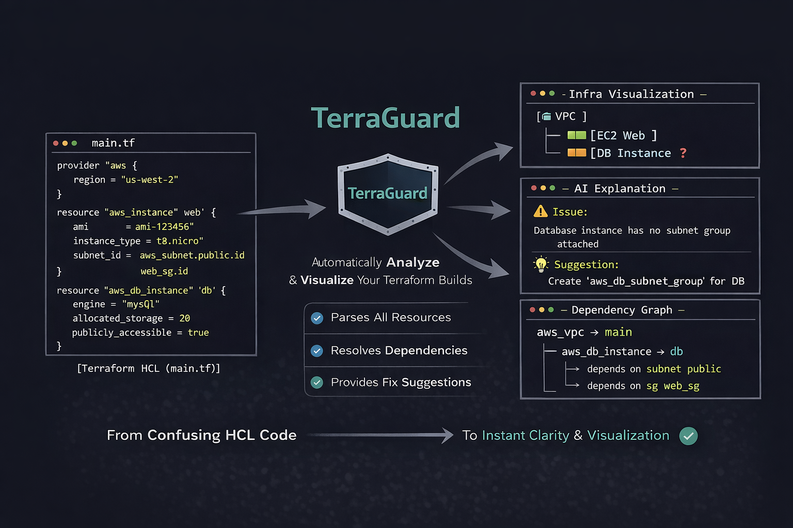
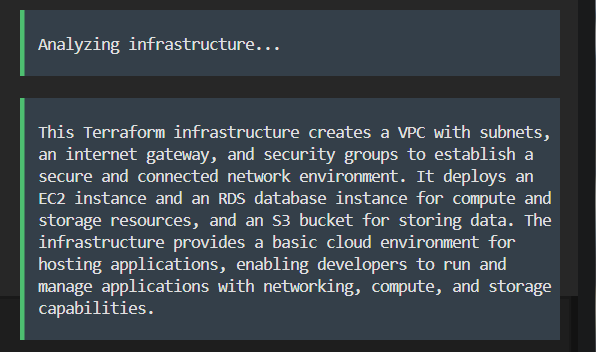
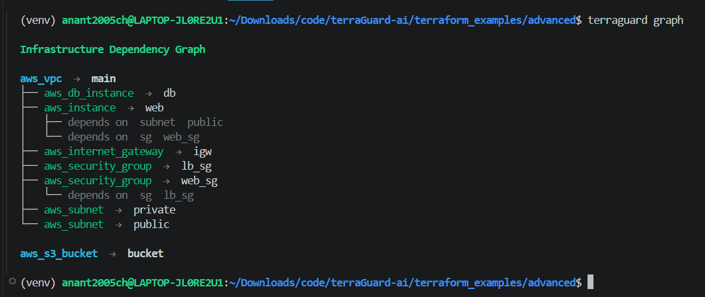
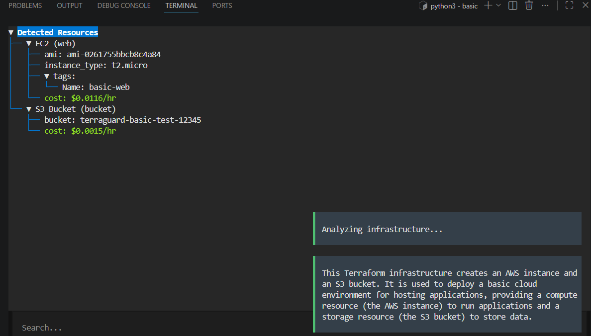
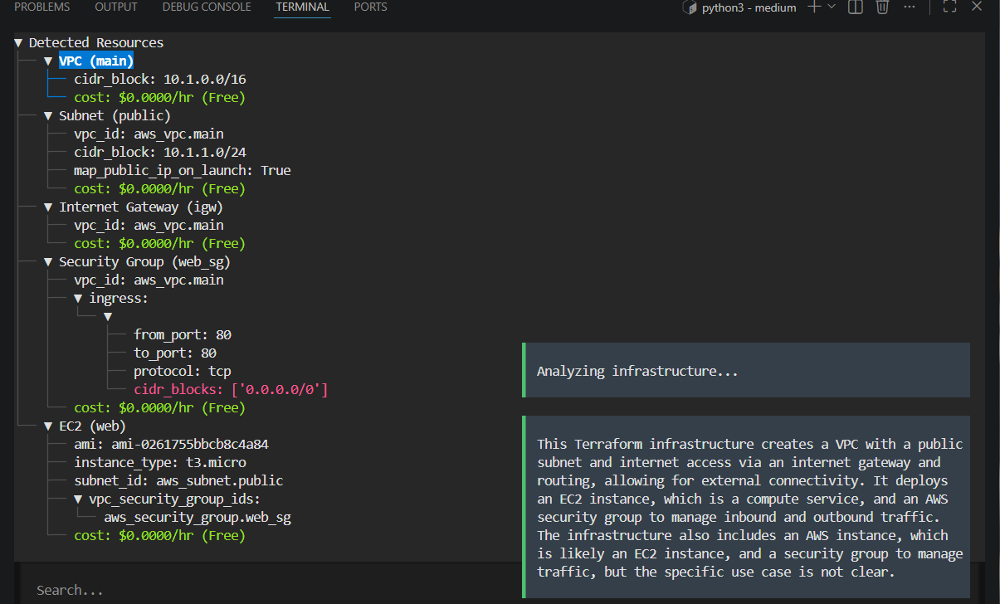
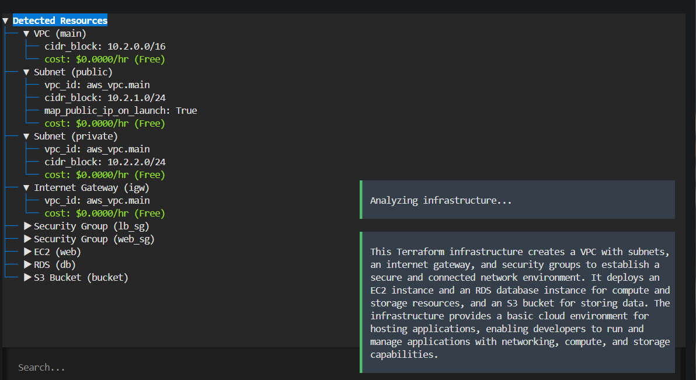

# TerraGuard 🚀

<p align="center">
  
</p>

### AI-Augmented Terraform Intelligence & Pre-Deployment Analysis Platform

**TerraGuard** is a next-generation DevOps platform that brings **AI-assisted reasoning,  Structured parsing and normalization of IaC, cost intelligence and Graph-based dependency** into the Terraform workflow — enabling engineers to **understand, visualize, and evaluate infrastructure before it is deployed**.

As Infrastructure-as-Code scales, Terraform configurations become increasingly complex, abstract, and difficult to interpret. While existing tools focus on execution and state changes, they lack the ability to **explain infrastructure as a system — how components interact, what they represent, and what they are ultimately built for**.

👉 Built for terminal-first DevOps workflows, TerraGuard delivers fast, in-context analysis through a powerful TUI — eliminating the need for external dashboards and keeping engineers fully in the CLI.

TerraGuard introduces an **intelligent analysis layer** on top of Terraform by combining:

* 🧠 AI-powered infrastructure interpretation
* 🧩 Structured parsing and normalization of IaC
* 🌳 Graph-based dependency modeling
* 💰 Cloud pricing intelligence via AWS APIs

👉 transforming raw Terraform into **clear, explainable, and actionable infrastructure insights**

👉 Even without AI, TerraGuard provides **structured analysis, dependency visualization, and cost evaluation**, ensuring meaningful insights are always available.


---

## ⚡ Core Capabilities

* 🧩 Parse Terraform into structured resource models
* 🌳 Build dependency graphs to represent relationships
* 💰 Evaluate cost using AWS Pricing APIs
* 🧠 Integrate AI to explain infrastructure clearly
* 🖥️ Provide an interactive TUI for exploration

👉 Bridges the gap between **writing infrastructure and understanding it**

---

## 🧠 AI-Assisted Infrastructure Understanding

TerraGuard integrates an AI reasoning layer that interprets infrastructure and converts it into **clear, concise, and meaningful explanations**.

<p align="center">
  
</p>

* Translates complex Terraform into **human-understandable insights**
* Explains both **structure and real-world purpose**
* Enhances collaboration between developers, DevOps, and teams

👉 AI acts as an **interpretation layer over structured infrastructure data**, not a replacement for it

---

## 🧩 Infrastructure Parsing & Modeling

TerraGuard transforms Terraform into a **structured infrastructure model**:

* Extracts resources from `.tf` configurations
* Resolves variables and interpolations
* Interprets dynamic constructs (`count`, `for_each`)
* Normalizes infrastructure into a **graph-ready representation**

👉 Enables deeper analysis beyond raw IaC

---

## 🌳 Dependency Graph & Visualization

<p align="center">
  
</p>

Models infrastructure as a **directed dependency graph**:

* Captures relationships between resources
* Represents connectivity and execution flow
* Enables architectural reasoning before deployment

👉 Allows you to **visualize infrastructure before it exists**

---

## 💰 Cost Evaluation Engine

TerraGuard integrates with the **AWS Pricing API (boto3)** to perform **dynamic cost evaluation**:

```text
EC2 → $0.0104/hr  
S3 → $0.0023/hr  
RDS → Based on instance configuration  
```

* Maps Terraform resources to pricing dimensions
* Resolves region-aware pricing dynamically
* Produces **resource-level cost breakdowns**

👉 Enables **cost-aware infrastructure planning**

---

## 🔍 Terraform Plan vs TerraGuard

Terraform focuses on execution. TerraGuard focuses on **understanding**.

| Feature                      | Terraform Plan | TerraGuard |
| ---------------------------- | -------------- | ---------- |
| Shows resource changes       | ✅              | ✅          |
| Explains architecture        | ❌              | ✅          |
| Human-readable understanding | ❌              | ✅          |
| Cost estimation              | ❌              | ✅          |
| Dependency visualization     | ❌              | ✅          |
| Pre-deployment insight       | ⚠️ Limited     | ✅ Strong   |

👉 Terraform answers *“what will happen”*
👉 TerraGuard explains *“what this infrastructure actually is and why it exists”*

---

## 🖥️ Interactive Terminal UI (TUI)

```bash
terraguard init
```

### 🎮 Controls

| Key | Action                      |
| --- | --------------------------- |
| q   | Quit                        |
| c   | Copy selected resource      |
| C   | Copy all resources + cost   |
| /   | Search                      |
| e   | Explain selected resource   |
| E   | Explain full infrastructure |

* Unified view of **structure, cost, and AI insights**
* Designed for efficient DevOps workflows

---

## 🧪 Infrastructure Analysis Examples

### 🔹 Basic

<p align="center">
  
</p>

---

### 🔹 Medium

<p align="center">
  
</p>

---

### 🔹 Advanced

<p align="center">
  
</p>

---

## ⚙️ System Architecture

```text
terraguard/
│
├── cli.py
├── parser.py
├── variable_resolver.py
├── cost_engine.py
├── pricing_engine.py
├── diagram.py
├── formatter.py
├── tui/
├── ai_explainer.py
└── optimizer/
```

---

## 🛠️ Tech Stack

* Python
* Typer
* Rich
* Textual
* python-hcl2
* AWS Pricing API (boto3)
* Groq API

---

## 🔮 Future Roadmap

* ☁️ Multi-cloud support (AWS, Azure, GCP) for unified infrastructure analysis  
* 🔁 CI/CD integration for automated pre-deployment validation  
* 📊 Terraform plan analysis for deeper change visibility  
* 🚨 Security & policy validation to detect misconfigurations early  
* 💰 Budget enforcement with intelligent cost thresholds  
* 🤖 Autonomous infrastructure optimization using AI-driven recommendations  

👉 Vision: Evolve TerraGuard into a fully autonomous DevOps AI agent capable of analyzing, securing, and optimizing infrastructure before deployment.
---

## 🎯 Use Cases

* Understand infrastructure before deployment
* Simplify complex Terraform configurations
* Validate architecture design
* Perform cost-aware planning
* Learn and visualize cloud systems

---

## 👨‍💻 Author

Built by **Anant Chaudhary**

DevOps Engineer (aspiring) | Building intelligent cloud systems 🚀

---

## ⭐ Vision

👉 **From writing infrastructure → to understanding infrastructure before it exists**

TerraGuard represents the future of DevOps where infrastructure is **interpreted, visualized, and intelligently analyzed before deployment.**
# TerraGuard-ai
